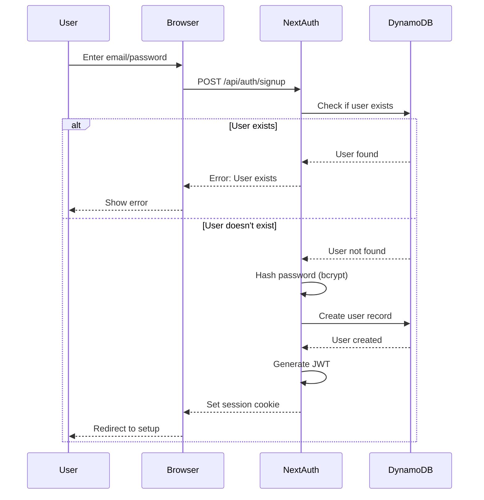
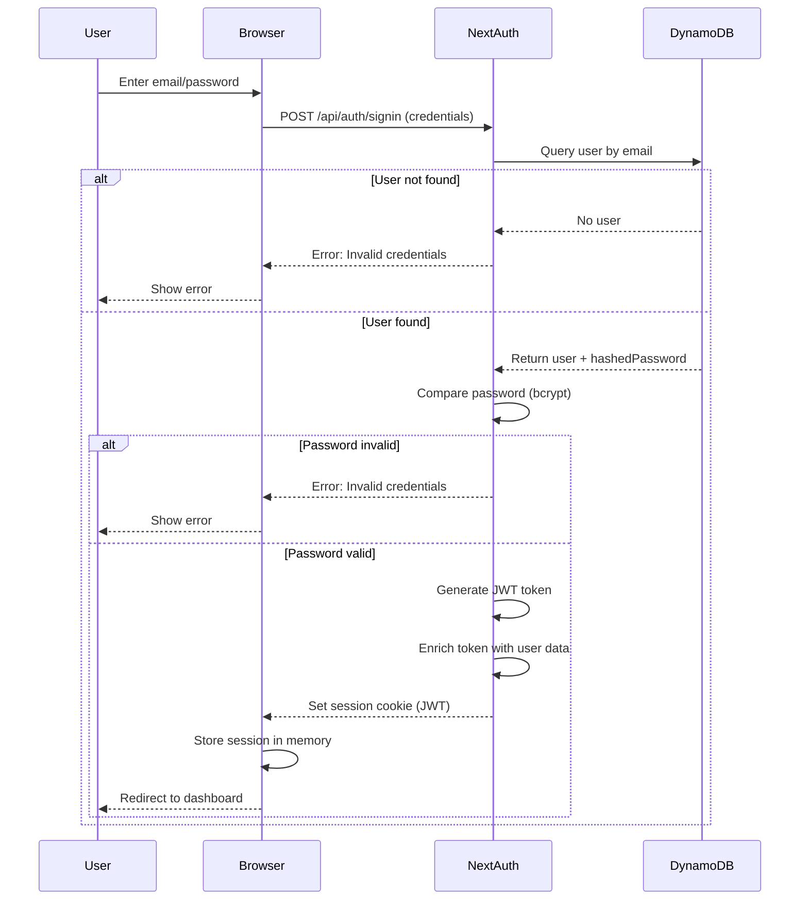
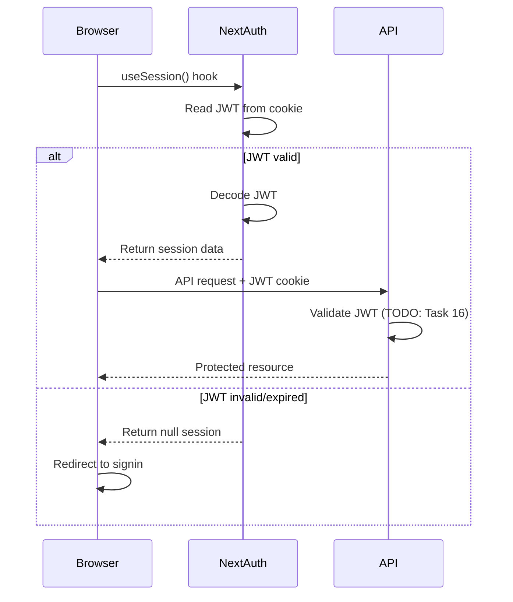
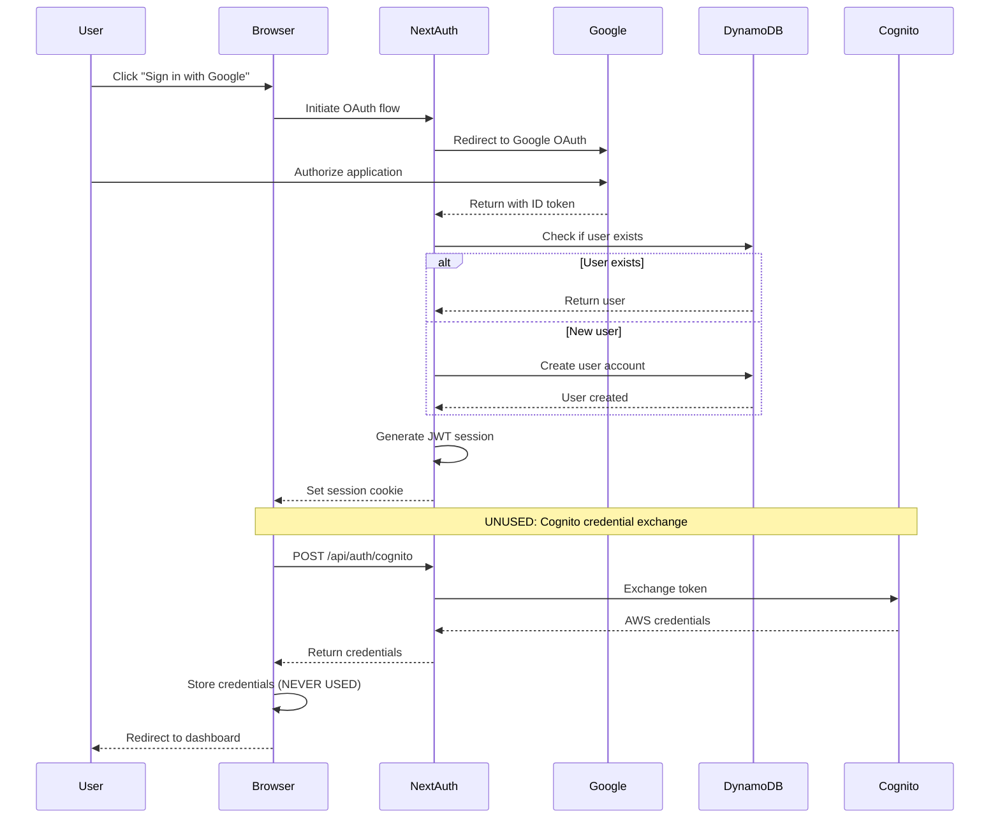
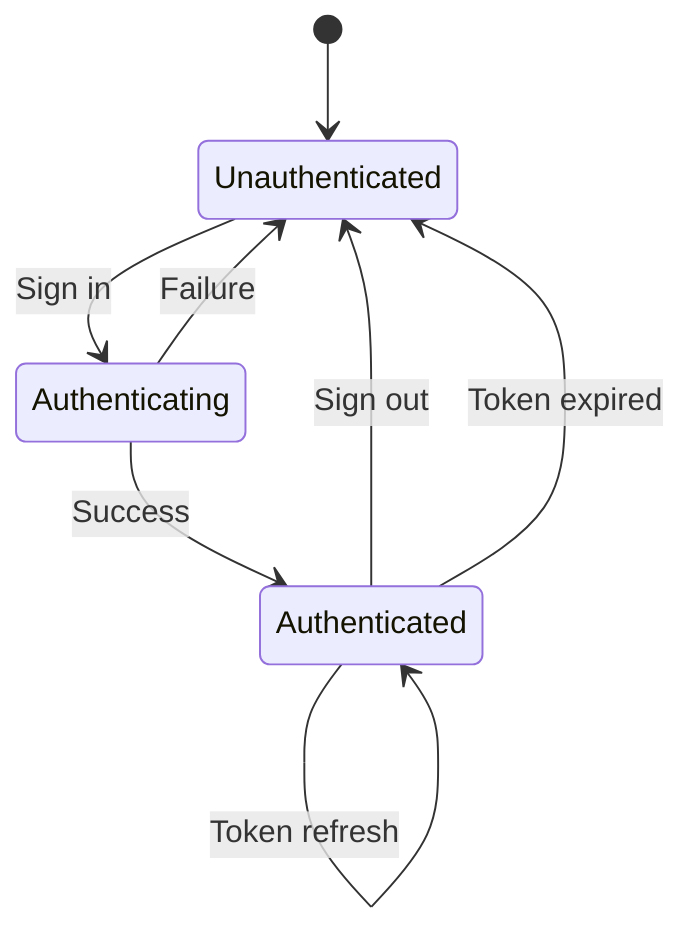
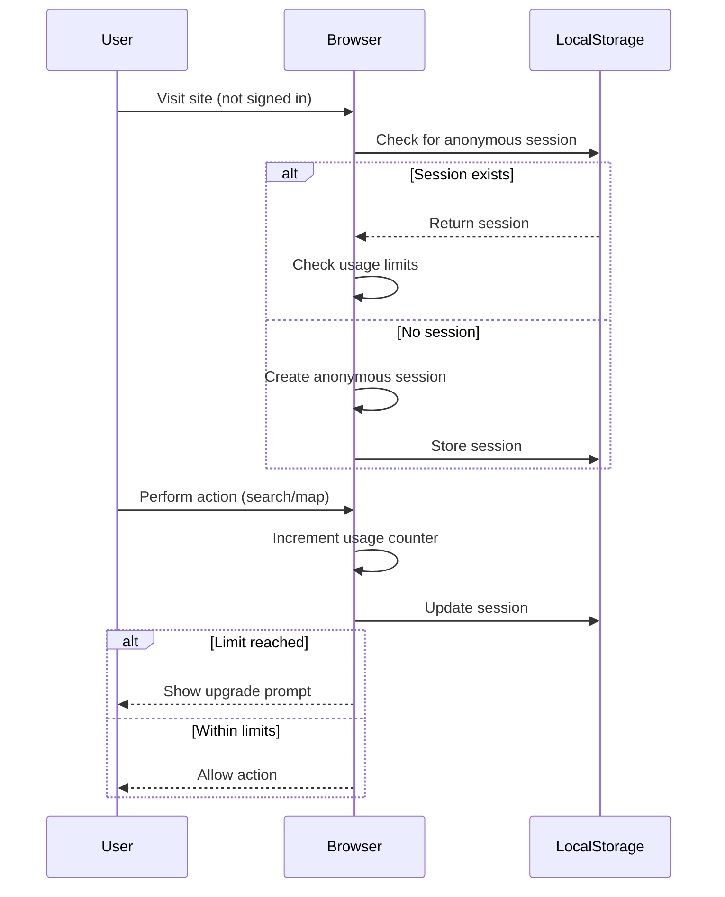
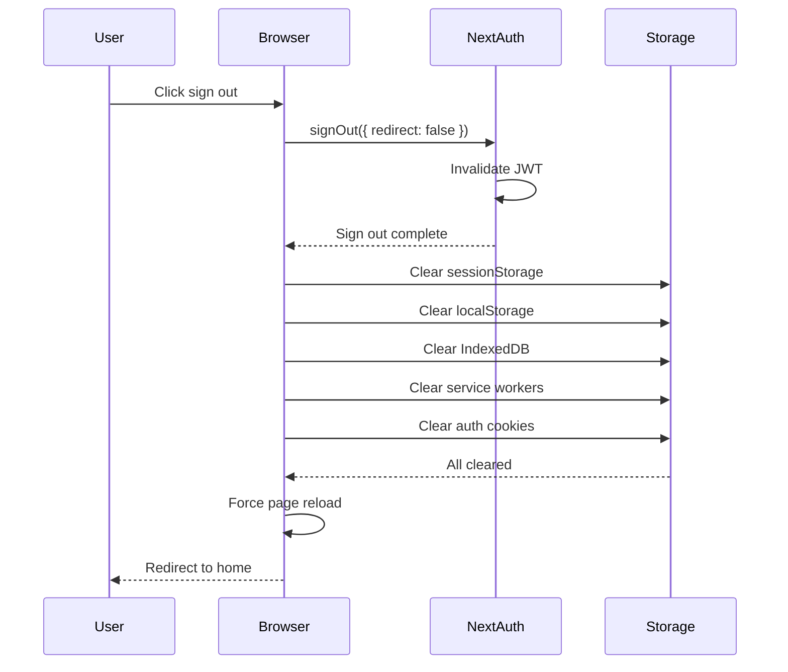
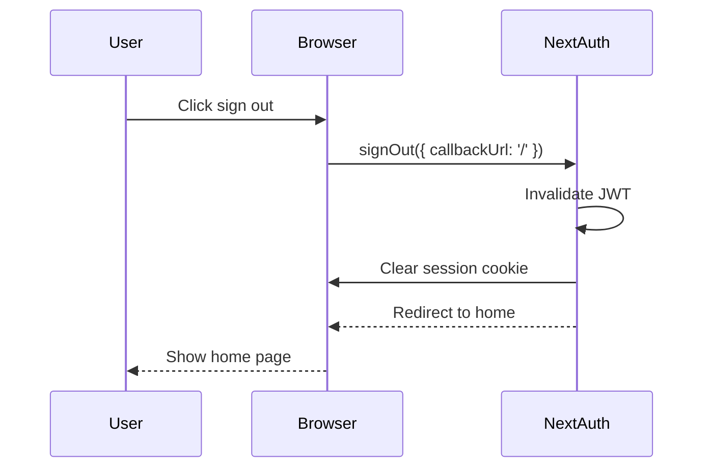

# Authentication Flow Documentation

## Overview

This document provides detailed authentication flows for the Faces of Plants platform, showing how users authenticate and how sessions are managed.

## Authentication Methods

The platform supports two primary authentication methods:

1. **Email/Password (Credentials Provider)**
2. **Google OAuth (Social Login)**

## Flow 1: Email/Password Authentication

### Sign Up Flow



### Sign In Flow



### Session Validation Flow



## Flow 2: Google OAuth Authentication

### OAuth Sign In Flow



### Key Observations

1. **Cognito credentials are fetched but never used** - This is unnecessary complexity
2. **Only OAuth providers trigger Cognito flow** - Credentials provider skips this
3. **AWS credentials are stored in AuthContext** but no component consumes them

## Session Management

### JWT Token Structure

```typescript
{
  // Standard JWT claims
  iat: 1234567890,        // Issued at
  exp: 1234567890,        // Expires at
  jti: "unique-id",       // JWT ID
  
  // NextAuth claims
  name: "John Doe",
  email: "john@example.com",
  picture: "https://...",
  sub: "user-id",         // Subject (user ID)
  
  // Custom claims
  user: {
    id: "user-id",
    email: "john@example.com",
    name: "John Doe",
    firstName: "John",
    lastName: "Doe",
    userType: "citizen",  // or "researcher", "admin"
  },
  
  // Provider-specific (OAuth only)
  accessToken: "...",     // Provider access token
  idToken: "...",         // Provider ID token
  provider: "google",     // Provider name
}
```

### Session Storage Strategy

**Strategy**: JWT (Stateless)

**Storage Locations**:
- **Cookie**: HTTP-only, secure, same-site
- **Client Memory**: Via `useSession()` hook
- **NOT in Database**: Sessions are not persisted (by design)

**DynamoDB Usage**:
- User profiles (PK: USER#email, SK: USER#email)
- OAuth accounts (PK: ACCOUNT#provider|id, SK: ACCOUNT#provider|id)
- Verification tokens (for email verification)
- **NOT sessions** (JWT strategy is stateless)

### Session Lifecycle



### Token Refresh

NextAuth automatically handles token refresh:
- Tokens are refreshed before expiration
- Refresh happens transparently via `useSession()`
- No manual refresh logic needed

## Authorization Flow (Current State)

### Frontend Authorization

```typescript
// Using useAuth hook
const { user, userType, isAuthenticated } = useAuth();

// Check authentication
if (!isAuthenticated) {
  router.push('/auth/signin');
}

// Check user type
if (userType !== 'admin') {
  return <div>Access denied</div>;
}
```

### Backend Authorization (TODO: Task 16)

**Current State**: ❌ No JWT validation on API routes

**Required Implementation**:
```typescript
// Middleware to validate JWT
export async function middleware(request: NextRequest) {
  const token = await getToken({ req: request });
  
  if (!token) {
    return new NextResponse('Unauthorized', { status: 401 });
  }
  
  // Extract user context
  request.headers.set('x-user-id', token.sub);
  request.headers.set('x-user-type', token.user?.userType);
  
  return NextResponse.next();
}
```

## Anonymous Session Flow

For unauthenticated users, the platform provides limited functionality:



### Anonymous Session Structure

```typescript
{
  sessionId: "anon_1234567890_abc123",
  startTime: "2024-12-02T10:00:00Z",
  searchCount: 5,
  mapInteractions: 20,
  lastActivity: "2024-12-02T10:30:00Z",
  usageLimits: {
    maxSearches: 10,
    maxMapInteractions: 50,
  }
}
```

## Sign Out Flow

### Current Implementation (Aggressive)



### Recommended Implementation (Simplified)



**Rationale**: NextAuth's built-in sign out is sufficient. Aggressive clearing is overkill and may cause issues.

## Security Considerations

### Current Security Measures

✅ **Implemented**:
- Passwords hashed with bcrypt (10 rounds)
- JWT tokens signed with secret
- HTTP-only cookies (prevents XSS)
- Secure cookies (HTTPS only)
- Same-site cookies (prevents CSRF)

⚠️ **Missing** (To be implemented):
- JWT validation middleware on API routes (Task 16)
- Rate limiting on auth endpoints (Task 5)
- Account lockout after failed attempts
- Password strength requirements
- Email verification
- Two-factor authentication

### Token Security

**JWT Secret**: Stored in `AUTH_SECRET` environment variable
- Should be moved to SST secrets (Task 41)
- Must be at least 32 characters
- Should be different per environment

**Token Expiration**:
- Default: 30 days
- Configurable via NextAuth options
- Automatically refreshed by NextAuth

## Error Handling

### Authentication Errors

| Error Code | Meaning | User Message |
|------------|---------|--------------|
| `UserNotFound` | Email not in database | "Wrong email or password" |
| `InvalidCredentials` | Password doesn't match | "Wrong email or password" |
| `AuthenticationFailed` | General auth error | "Authentication failed" |
| `OAuthError` | OAuth provider error | "Sign in with Google failed" |

**Note**: Generic error messages prevent user enumeration attacks

### Session Errors

| Scenario | Behavior |
|----------|----------|
| JWT expired | Redirect to sign in |
| JWT invalid | Redirect to sign in |
| JWT missing | Allow anonymous access |
| Refresh failed | Sign out user |

## Testing Authentication

### Manual Testing Checklist

- [ ] Sign up with email/password
- [ ] Sign in with email/password
- [ ] Sign in with Google OAuth
- [ ] Sign out
- [ ] Access protected route while signed out
- [ ] Access protected route while signed in
- [ ] Token expiration handling
- [ ] Refresh token flow
- [ ] Anonymous session creation
- [ ] Anonymous usage limits

### Automated Testing (TODO)

```typescript
// Unit tests
- JWT token generation
- Password hashing/comparison
- User lookup by email
- Session validation

// Integration tests
- Full sign up flow
- Full sign in flow
- OAuth flow
- Sign out flow
- Protected route access

// Property-based tests (Task 16)
- JWT validation with random tokens
- Authentication failures return 401
```

## Troubleshooting

### Common Issues

**Issue**: "Session not found"
- **Cause**: JWT expired or invalid
- **Solution**: Sign in again

**Issue**: "Unauthorized" on API calls
- **Cause**: No JWT validation middleware (Task 16 not complete)
- **Solution**: Implement JWT validation middleware

**Issue**: "Cognito credentials error"
- **Cause**: Cognito token exchange failing
- **Solution**: This is unused code, can be removed

**Issue**: "User not found" after OAuth
- **Cause**: User creation failed
- **Solution**: Check DynamoDB permissions

## Next Steps

Based on this authentication flow analysis, the next tasks are:

1. **Task 16**: Implement JWT validation middleware
   - Validate tokens on API routes
   - Extract user context
   - Return 401 for invalid tokens

2. **Remove unused Cognito code**:
   - Remove CognitoProvider
   - Remove `/api/auth/cognito` endpoint
   - Remove credential fetching from AuthContext

3. **Simplify AuthContext**:
   - Remove credential state
   - Simplify sign out logic
   - Separate anonymous session management

4. **Add authentication tests**:
   - Unit tests for auth functions
   - Integration tests for auth flows
   - Property tests for JWT validation

## References

- [NextAuth.js Documentation](https://next-auth.js.org/)
- [JWT Best Practices](https://tools.ietf.org/html/rfc8725)
- [OAuth 2.0 Security Best Practices](https://tools.ietf.org/html/draft-ietf-oauth-security-topics)
- [OWASP Authentication Cheat Sheet](https://cheatsheetseries.owasp.org/cheatsheets/Authentication_Cheat_Sheet.html)
