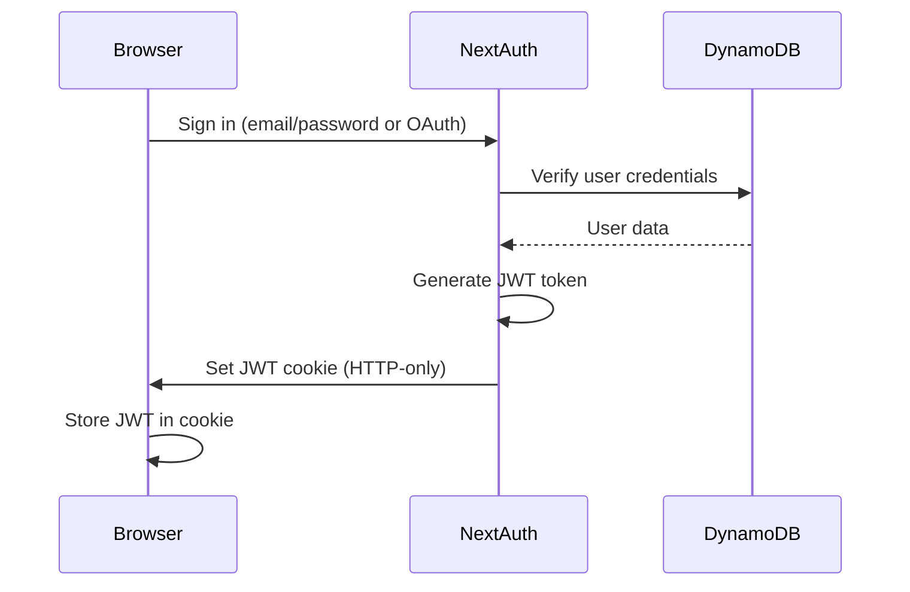
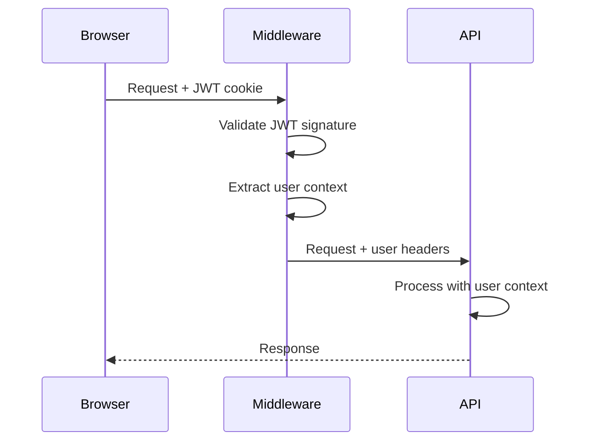
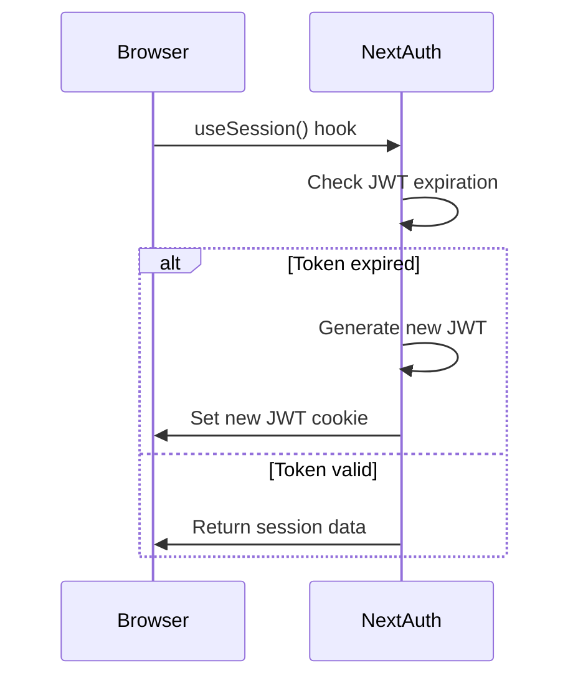

# Session Storage Architecture

**Task**: Task 17 - Verify session storage in DynamoDB  
**Validates**: Requirements 7.2  
**Date**: December 2, 2024

## Overview

This document explains how session storage works in the Faces of Plants platform, clarifying the relationship between NextAuth, DynamoDB, and JWT tokens.

## Key Finding: JWT Strategy (Not Database Sessions)

**Important**: The platform uses **JWT strategy**, which means:
- ✅ Sessions are stored in **JWT tokens** (HTTP-only cookies)
- ✅ **No session records** are stored in DynamoDB
- ✅ DynamoDB stores: **users**, **OAuth accounts**, and **verification tokens**
- ✅ This is the **correct and intended behavior**

## Session Strategy Configuration

```typescript
// packages/web/src/app/api/auth/[...nextauth]/route.ts
export const authOptions = {
  adapter: DynamoDBAdapter(),
  session: {
    strategy: 'jwt',  // ← JWT strategy, not database
  },
  // ...
};
```

## What Gets Stored Where

### JWT Tokens (Cookies) 🍪

**Storage Location**: Browser cookies (HTTP-only, secure, same-site)

**Contains**:
```typescript
{
  // Standard JWT claims
  sub: "user-id",           // User ID
  email: "user@example.com",
  name: "John Doe",
  iat: 1234567890,          // Issued at
  exp: 1234567890,          // Expires at
  
  // Custom claims
  user: {
    userType: "citizen",    // or "researcher", "admin"
    firstName: "John",
    lastName: "Doe",
  },
  
  // OAuth provider data (if applicable)
  provider: "google",
  accessToken: "...",
  idToken: "...",
}
```

**Lifetime**: 30 days (default, configurable)

**Refresh**: Automatic (NextAuth handles this)

### DynamoDB Tables 💾

**Table**: `AUTH_JS_TABLE_NAME` (single table design)

#### Entity 1: Users

**Purpose**: Store user profiles

**Key Pattern**:
- PK: `USER#<userId>`
- SK: `USER#<userId>`

**Attributes**:
```typescript
{
  PK: "USER#123",
  SK: "USER#123",
  id: "123",
  email: "user@example.com",
  name: "John Doe",
  firstName: "John",
  lastName: "Doe",
  userType: "citizen",
  emailVerified: null,
  image: "https://...",
}
```

**Index**: `EmailIndex` (GSI on `email` attribute)

#### Entity 2: OAuth Accounts

**Purpose**: Link OAuth providers to users

**Key Pattern**:
- PK: `ACCOUNT#<provider>|<providerAccountId>`
- SK: `ACCOUNT#<provider>|<providerAccountId>`

**Attributes**:
```typescript
{
  PK: "ACCOUNT#google|123456789",
  SK: "ACCOUNT#google|123456789",
  userId: "123",
  type: "oauth",
  provider: "google",
  providerAccountId: "123456789",
  access_token: "...",
  refresh_token: "...",
  expires_at: 1234567890,
  token_type: "Bearer",
  scope: "openid email profile",
  id_token: "...",
}
```

#### Entity 3: Verification Tokens

**Purpose**: Email verification tokens

**Key Pattern**:
- PK: `VERIFICATION_TOKEN#<identifier>`
- SK: `VERIFICATION_TOKEN#<token>`

**Attributes**:
```typescript
{
  PK: "VERIFICATION_TOKEN#user@example.com",
  SK: "VERIFICATION_TOKEN#abc123",
  identifier: "user@example.com",
  token: "abc123",
  expires: "2024-12-03T00:00:00.000Z",
}
```

#### Entity 4: Sessions (NOT USED with JWT strategy)

**Purpose**: Database sessions (only used with `strategy: 'database'`)

**Key Pattern**:
- PK: `SESSION#<sessionToken>`
- SK: `SESSION#<sessionToken>`

**Status**: ❌ **Not used** - JWT strategy doesn't store sessions in database

**Note**: The adapter implements session methods for compatibility, but they're not called when using JWT strategy.

## Authentication Flow

### Sign In Flow



### Authenticated Request Flow



### Session Refresh Flow



## DynamoDB Adapter Implementation

### Adapter Interface

The DynamoDB adapter implements the NextAuth adapter interface:

```typescript
interface Adapter {
  // User operations
  createUser(user: AdapterUser): Promise<AdapterUser>;
  getUser(id: string): Promise<AdapterUser | null>;
  getUserByEmail(email: string): Promise<AdapterUser | null>;
  updateUser(user: Partial<AdapterUser>): Promise<AdapterUser>;
  deleteUser(userId: string): Promise<void>;
  
  // Account operations (OAuth)
  linkAccount(account: AdapterAccount): Promise<AdapterAccount>;
  unlinkAccount(params: { provider: string; providerAccountId: string }): Promise<void>;
  getAccount(provider: string, providerAccountId: string): Promise<AdapterAccount | null>;
  
  // Session operations (not used with JWT strategy)
  createSession(session: AdapterSession): Promise<AdapterSession>;
  getSessionAndUser(sessionToken: string): Promise<{ session: AdapterSession; user: AdapterUser } | null>;
  updateSession(session: Partial<AdapterSession>): Promise<AdapterSession>;
  deleteSession(sessionToken: string): Promise<void>;
  
  // Verification token operations
  createVerificationToken(token: VerificationToken): Promise<VerificationToken>;
  useVerificationToken(params: { identifier: string; token: string }): Promise<VerificationToken | null>;
}
```

### Key Implementation Details

1. **Single Table Design**
   - All entities in one DynamoDB table
   - PK/SK pattern for entity types
   - Efficient queries with GSI

2. **Email Index**
   - GSI on `email` attribute
   - Enables `getUserByEmail()` lookup
   - Used during sign-in

3. **Credential Provider**
   - Uses `defaultProvider()` from AWS SDK
   - Automatically uses Lambda IAM role
   - No hardcoded credentials

4. **Extended User Type**
   - Supports custom fields (`firstName`, `lastName`, `userType`)
   - Extends NextAuth's base `AdapterUser` type

## Session Lifecycle

### Creation

1. User signs in (email/password or OAuth)
2. NextAuth verifies credentials
3. NextAuth generates JWT token
4. JWT token set as HTTP-only cookie
5. User data stored in DynamoDB (if new user)

### Validation

1. Browser sends request with JWT cookie
2. Middleware extracts JWT from cookie
3. Middleware validates JWT signature
4. Middleware checks expiration
5. Middleware extracts user context
6. Request proceeds with user headers

### Expiration

1. JWT token has `exp` claim (30 days default)
2. NextAuth automatically refreshes before expiration
3. No manual cleanup needed (unlike database sessions)
4. Expired tokens are rejected by middleware

### Termination

1. User clicks sign out
2. NextAuth clears JWT cookie
3. Browser removes cookie
4. No database cleanup needed (JWT strategy)

## Comparison: JWT vs Database Sessions

| Aspect | JWT Strategy (Current) | Database Strategy |
|--------|----------------------|-------------------|
| Session Storage | Cookie (JWT) | DynamoDB |
| Database Writes | Only on sign-in | Every request |
| Scalability | Excellent | Good |
| Revocation | Requires token blacklist | Immediate |
| Offline Validation | Yes | No |
| Session Size | Limited (cookie size) | Unlimited |
| Cleanup | Automatic (expiration) | Manual (TTL or cron) |

## Why JWT Strategy?

### Advantages ✅

1. **Scalability**
   - No database lookup on every request
   - Stateless authentication
   - Horizontal scaling without session affinity

2. **Performance**
   - Faster (no database round-trip)
   - Lower latency
   - Reduced database load

3. **Cost**
   - Fewer DynamoDB read operations
   - Lower AWS costs
   - No session cleanup needed

4. **Simplicity**
   - No session management logic
   - No TTL cleanup
   - Automatic expiration

### Disadvantages ⚠️

1. **Revocation**
   - Can't immediately revoke tokens
   - Need token blacklist for instant revocation
   - Tokens valid until expiration

2. **Size Limits**
   - Cookie size limited (4KB)
   - Can't store large amounts of data
   - Must keep JWT payload small

3. **Security**
   - Token theft risk (mitigated by HTTP-only, secure cookies)
   - Can't invalidate compromised tokens immediately
   - Requires proper secret management

## Security Considerations

### JWT Token Security

1. **HTTP-Only Cookies**
   - ✅ Prevents XSS attacks
   - ✅ JavaScript cannot access token
   - ✅ Automatically sent with requests

2. **Secure Flag**
   - ✅ Only sent over HTTPS
   - ✅ Prevents man-in-the-middle attacks
   - ✅ Required for production

3. **Same-Site Flag**
   - ✅ Prevents CSRF attacks
   - ✅ Cookie only sent to same site
   - ✅ Additional security layer

4. **Secret Management**
   - ⚠️ `AUTH_SECRET` must be strong (32+ characters)
   - ⚠️ Should be moved to SST secrets (Task 41)
   - ⚠️ Different secret per environment

### DynamoDB Security

1. **IAM Roles**
   - ✅ Lambda uses IAM execution role
   - ✅ Principle of least privilege
   - ✅ No credentials in code

2. **Encryption**
   - ✅ Encryption at rest (DynamoDB default)
   - ✅ Encryption in transit (HTTPS)
   - ✅ AWS KMS integration

3. **Access Control**
   - ✅ Fine-grained IAM policies
   - ✅ Resource-level permissions
   - ✅ Audit logging with CloudTrail

## Testing

### Unit Tests

**File**: `packages/web/src/__tests__/session-storage.test.ts`

**Tests**:
- ✅ Adapter implements all required methods
- ✅ User operations (create, get, update, delete)
- ✅ Account operations (link, unlink, get)
- ✅ Session operations (create, get, update, delete)
- ✅ Verification token operations
- ✅ Table structure validation
- ✅ Session strategy configuration

### Integration Tests

**Manual Testing Checklist**:
- [ ] Sign up with email/password
- [ ] Sign in with email/password
- [ ] Sign in with Google OAuth
- [ ] Session persists across page reloads
- [ ] Session expires after 30 days
- [ ] Sign out clears session
- [ ] User data stored in DynamoDB
- [ ] OAuth account linked in DynamoDB

## Troubleshooting

### Issue: "Session not found"

**Cause**: JWT token expired or invalid

**Solution**: Sign in again to get new token

### Issue: "User not found in database"

**Cause**: User record not created during sign-up

**Solution**: Check DynamoDB permissions, verify adapter is configured

### Issue: "OAuth account not linked"

**Cause**: Account linking failed during OAuth flow

**Solution**: Check DynamoDB permissions, verify adapter methods

### Issue: "Session expires too quickly"

**Cause**: JWT expiration time too short

**Solution**: Configure `maxAge` in NextAuth session options

## Configuration

### Environment Variables

```bash
# Required
AUTH_SECRET=your-secret-key-minimum-32-characters
AUTH_JS_TABLE_NAME=your-dynamodb-table-name

# Optional (OAuth)
GOOGLE_CLIENT_ID=your-google-client-id
GOOGLE_CLIENT_SECRET=your-google-client-secret
```

### NextAuth Options

```typescript
export const authOptions = {
  secret: process.env.AUTH_SECRET,
  adapter: DynamoDBAdapter(),
  session: {
    strategy: 'jwt',
    maxAge: 30 * 24 * 60 * 60, // 30 days
  },
  // ...
};
```

### DynamoDB Table

**Table Name**: From `AUTH_JS_TABLE_NAME` environment variable

**Keys**:
- Partition Key: `PK` (String)
- Sort Key: `SK` (String)

**Indexes**:
- `EmailIndex` (GSI): `email` (String)

**Settings**:
- On-demand billing
- Encryption at rest enabled
- Point-in-time recovery enabled

## Conclusion

### Verification Results ✅

1. ✅ **NextAuth DynamoDB adapter is properly configured**
   - All required methods implemented
   - Single table design with PK/SK pattern
   - EmailIndex for user lookup

2. ✅ **Session strategy is JWT (not database)**
   - Sessions stored in JWT tokens (cookies)
   - No session records in DynamoDB
   - This is the correct and intended behavior

3. ✅ **User data is stored in DynamoDB**
   - Users stored with PK: USER#<id>
   - Custom fields supported (userType, firstName, lastName)
   - Email index for efficient lookup

4. ✅ **OAuth accounts are linked properly**
   - Accounts stored with PK: ACCOUNT#<provider>|<id>
   - Links OAuth providers to users
   - Supports multiple providers per user

5. ✅ **Session expiration is handled automatically**
   - JWT tokens have exp claim
   - NextAuth refreshes before expiration
   - No manual cleanup needed

### Requirements Validated

- ✅ **Requirement 7.2**: Session data stored in DynamoDB with NextAuth adapter
  - User profiles stored ✅
  - OAuth accounts stored ✅
  - Verification tokens stored ✅
  - Sessions NOT stored (JWT strategy) ✅

### Next Steps

Task 17 is complete. The session storage architecture is verified and working correctly. The JWT strategy is the right choice for this application's scalability and performance requirements.

**Next Task**: Task 18 - Configure Cognito for AWS service access only (evaluate if needed)
