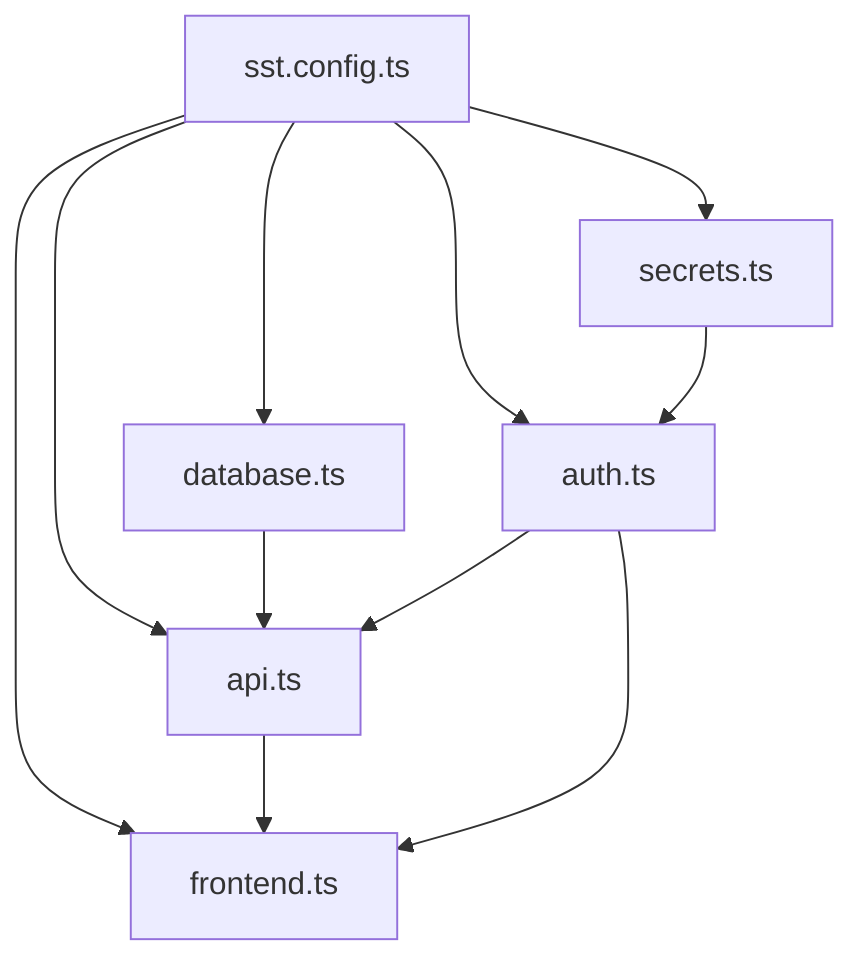

# Infrastructure Architecture

## Overview

This project uses a **modular SST v3 architecture** for clean separation of concerns and maintainability.

## Directory Structure

```
├── sst.config.ts          # Main orchestration (imports modules)
└── infra/                 # Infrastructure modules
    ├── database.ts        # DynamoDB tables
    ├── secrets.ts         # SST Secrets management  
    ├── auth.ts            # Cognito User Pool & authentication
    ├── api.ts             # API Gateway routes & Lambda functions
    └── frontend.ts        # Next.js site & CloudFront
```

## Module Dependencies



## Modules

### 1. `database.ts`
- **Purpose**: DynamoDB tables for user data
- **Exports**: `userCollectionsTable`, `queryHistoryTable`
- **Dependencies**: None

### 2. `secrets.ts`
- **Purpose**: Centralized secret management
- **Exports**: `llmApiKey`, `googleClientSecret`
- **Dependencies**: None

### 3. `auth.ts`
- **Purpose**: User authentication with Cognito + Google OAuth
- **Exports**: `userPool`, `userPoolId`, `googleClientId`
- **Dependencies**: `secrets.googleClientSecret`

### 4. `api.ts`
- **Purpose**: API Gateway routes and Lambda functions
- **Exports**: `api` (API Gateway instance)
- **Dependencies**: `database`, `secrets`, `auth` (optional)

### 5. `frontend.ts`
- **Purpose**: Next.js application and CloudFront distribution
- **Exports**: `web` (Next.js site)
- **Dependencies**: `api`, `auth` (optional)

## Benefits of This Architecture

✅ **Separation of Concerns**: Each module has a single responsibility  
✅ **Reusability**: Modules can be easily reused across projects  
✅ **Maintainability**: Easy to find and modify specific infrastructure  
✅ **Testability**: Each module can be tested independently  
✅ **Scalability**: Easy to add new modules (monitoring, admin, etc.)  
✅ **Team Collaboration**: Multiple developers can work on different modules  

## Adding New Infrastructure

### Example: Adding a Monitoring Module

1. **Create** `infra/monitoring.ts`:
```typescript
export function createMonitoring({ api }: { api: any }) {
  const dashboard = new sst.aws.CloudWatchDashboard("Dashboard", {
    // monitoring configuration
  });
  
  return { dashboard };
}
```

2. **Import** in `sst.config.ts`:
```typescript
import { createMonitoring } from "./infra/monitoring";

export default {
  async run() {
    // ... existing modules
    const monitoring = createMonitoring({ api });
    
    return {
      // ... existing returns
      monitoring: monitoring.dashboard.url,
    };
  }
};
```

## Next Steps

- **Phase 2**: Complete Cognito setup with UserPoolClient and Google provider
- **Phase 3**: Add JWT authorization to API routes
- **Phase 4**: Create admin dashboard module
- **Phase 5**: Add monitoring and analytics module
